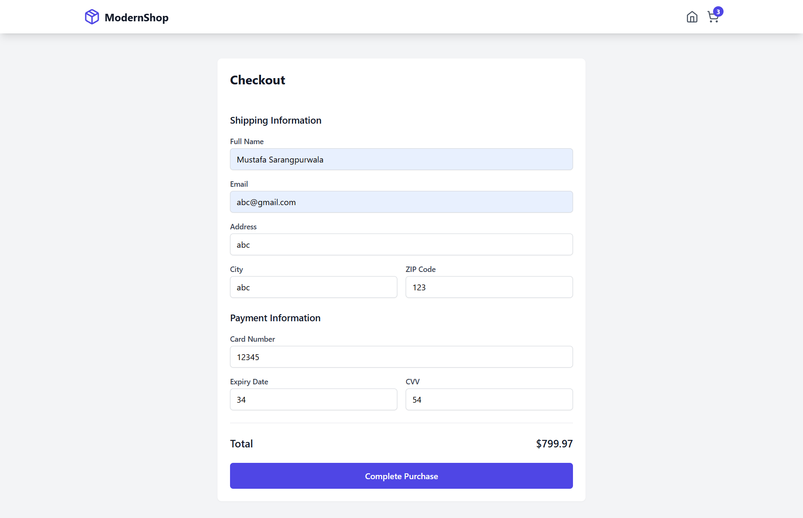

# ModernStore E-Commerce Project

## Overview

ModernStore is a comprehensive e-commerce application designed to provide a seamless shopping experience. The project leverages modern web development technologies to ensure a responsive, efficient, and scalable solution.

## Table of Contents

- [Technology Stack](#technology-stack)
- [Project Structure](#project-structure)
- [Key Features](#key-features)
- [Development Setup](#development-setup)
- [Strengths](#strengths)
- [Areas for Improvement](#areas-for-improvement)
- [Conclusion](#conclusion)
- [Screenshots](#screenshots)

## Technology Stack

### Frontend

1. **React**: A JavaScript library for building user interfaces. React is used for its component-based architecture, which promotes reusability and maintainability.
2. **TypeScript**: A superset of JavaScript that adds static typing. TypeScript helps in catching errors early during development and improves code quality.
3. **Vite**: A build tool that provides a faster and leaner development experience for modern web projects. Vite is used for its fast hot module replacement (HMR) and optimized build process.
4. **Tailwind CSS**: A utility-first CSS framework for rapidly building custom designs. Tailwind CSS is used for its flexibility and ease of use in creating responsive designs.
5. **Zustand**: A small, fast, and scalable state management solution. Zustand is used for managing the application's state in a simple and efficient manner.
6. **React Router DOM v6**: A collection of navigational components that compose declaratively with your application. React Router is used for handling routing within the application.
7. **Lucide React**: A collection of simple and consistent icon components. Lucide React is used for adding icons to the application.

### Backend

1. **Express**: A minimal and flexible Node.js web application framework. Express is used for building the backend API to handle product data and search functionality.
2. **CORS**: A middleware for enabling Cross-Origin Resource Sharing. CORS is used to allow the frontend application to communicate with the backend API.

### Development Tools

1. **ESLint**: A tool for identifying and reporting on patterns found in ECMAScript/JavaScript code. ESLint is used to ensure code quality and consistency.
2. **TypeScript**: Used not only in the frontend but also in the backend to provide type safety and improve code quality.

## Project Structure

### Frontend

- **components/**: Contains reusable UI components such as `ProductCard`, `Navbar`, etc.
- **pages/**: Contains route components like `Home`, `ProductDetail`, `Cart`, `Checkout`, etc.
- **store/**: Contains state management logic using Zustand.
- **types/**: Contains TypeScript definitions for various entities like `Product`, `CartItem`, etc.
- **data/**: Contains static data used in the application.

### Backend

- **index.js**: The main entry point for the Express server. It sets up routes, middleware, and error handling.

## Key Features

### Navigation

- Implemented using a `Navbar` component.
- Persistent shopping cart count.
- Navigation to homepage, cart, and product details.

### Product Management

- Product listing with search functionality.
- Detailed product view.
- Product data stored in a static file for simplicity.

### Shopping Cart

- Full cart functionality including adding/removing items, updating quantities, and calculating totals.
- Empty cart view when no items are present.

### Checkout Process

- Checkout form for customer details.
- Payment simulation with success/failure handling.
- Cart clearing after successful purchase.

### State Management

- Managed using Zustand for simplicity and performance.
- Handles cart operations, total calculation, and product operations.

### Routing

- Handled using React Router DOM v6.
- Routes for homepage, product details, cart, checkout, payment success, and payment failure.

## Development Setup

- **Start Development Server**: `npm run dev`
- **Build for Production**: `npm run build`
- **Run ESLint**: `npm run lint`

## Strengths

1. Modern tech stack ensuring performance and scalability.
2. Type-safe codebase with TypeScript.
3. Responsive design using Tailwind CSS.
4. Clean and maintainable project structure.
5. Efficient state management with Zustand.
6. Complete e-commerce workflow from product listing to checkout.

## Areas for Improvement

1. Add unit tests to ensure code reliability.
2. Implement a proper payment gateway for real transactions.
3. Add user authentication for a personalized shopping experience.
4. Integrate with a backend database for dynamic data management.
5. Implement comprehensive error handling for better user experience.

## Conclusion

ModernStore is a well-architected e-commerce application that leverages modern web technologies to provide a robust and scalable solution. With further enhancements and integrations, it can be developed into a fully-featured e-commerce platform.

## Screenshots

